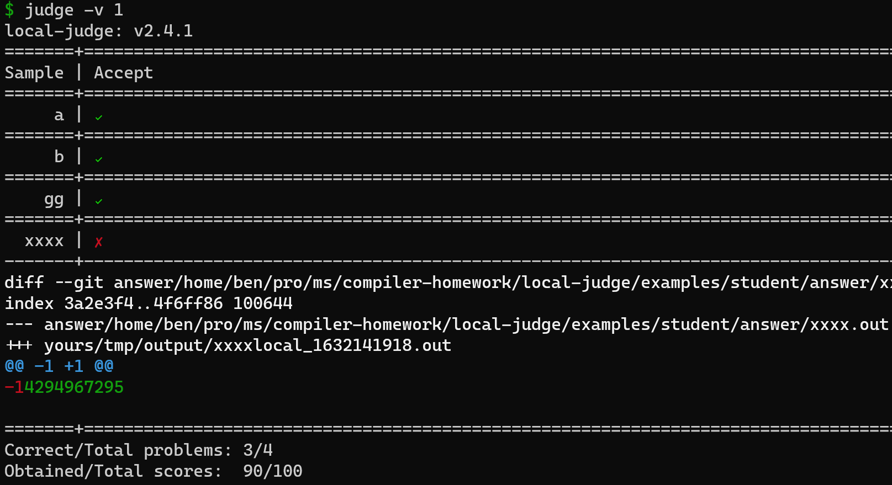

# Local Judge

[](https://www.python.org/downloads/)
[](LICENSE)
[](https://github.com/aben20807/local-judge/releases)

Given source code, Makefile (or build commands), input files, and answer files then judge the program locally.

## Workflow

```
+-------------------------------------------------------------------------------------+
| # TA (ta_judge.py):                                                                 |
|              +------------------------------[unzip]---------------------------+++++ |
|              | # Student (judge.py):                                          ||||| |
|              | source code ---+                                               ||||| |
|              |                | [build]                                       ||||| |
|              |                v                                               ||||| |
| hidden inp. --> input ---> program ---> output                                ||||| |
|              |              [run]         |                                   ||||| |
|              |                            v                                   ||||| |
| hidden ans. --> answer -------------> [compare] ---> correctness, diff result ||||| |
|              +-----------------------------------------|----------------------+++++ |
|                                                        ||||| [collect]              |
|                                                        vvvvv                        |
|                                                     score table                     |
+-------------------------------------------------------------------------------------+
```

## Screenshot



## Features

+ Both
  + Automatically build the source code into executable
  + Automatically run the executable for each input and compare output with answer
  + Customization friendly
  + Able to leverage git diff tool to compare the result with the answer
+ Student (`judge.py`)
  + Without any dependencies but standard build-in python packages
+ TA (`ta_judge.py`)
  + Support different zip type (`.zip`, `.rar`)
  + When error is occurred, not interrupt or exit but just log it 
  + Output to excel table

## Environment (Recommended)

+ Ubuntu 18.04
+ python 3.6
+ git 2.17.1

## Examples

+ [student](examples/student/)
+ [TA](examples/ta/)

## Usage (Student)

### Configuration

+ `judge.conf`: be placed in the root of your program
  + Content:
    + `BuildCommand`: how to build the executable
    + `Executable`: the name of the executable
    + `RunCommand`: how to run the executable with input and output
    + `Inputs`: input files (can use wildcard)
    + `TempOutputDir`: the temporary directory to place output files
    + `DiffCommand`: how to find differences between output and answer
    + `DeleteTempOutput`: whether to delete the temporary output after finding the differences (true or false)
    + `AnswerDir`: the directory where contains the answer files corresponding to the input files
    + `AnswerExtension`: the extension of the answer files
    + `ExitOrLog`: exit when any error occurred or just log the error
    + `TotalScore`: the total score of the assignment
  + Example config file:
    ```conf
    [Config]
    BuildCommand = make clean && make
    Executable = scanner
    RunCommand = ./scanner < {input} > {output}
    Inputs = input/*.txt
    TempOutputDir = /tmp/output
    DiffCommand = git diff --no-index --color-words
    DeleteTempOutput = true
    AnswerDir = answer
    AnswerExtension = .out
    ExitOrLog = exit
    TotalScore = 100
    ```

### Commands

```text
usage: judge.py [-h] [-c CONFIG] [-v VERBOSE]

optional arguments:
  -h, --help            show this help message and exit

  -c CONFIG, --config CONFIG
                        the config file, default: `judge.conf`

  -v VERBOSE, --verbose VERBOSE
                        the verbose level, default: `0`
                        `0`: suppress the diff results
                        `1`: show the diff results
  -i INPUT, --input INPUT
                        judge only one input with showing diff result
                        path or test name both work
                        for example: `-i xxxx` or `-i ../input/xxxx.txt`
```

## Usage (TA)

### Dependencies

+ `judge.py`
+ `openpyxl`: `pip install openpyxl`
+ `rarfile`: `pip install rarfile`

### Configuration

+ `judge.conf`: (Same as student)
+ `ta_judge.config`
  + Content:
    + `StudentsZipContainer`: the directory where contains students' submit homeworks
    + `StudentsPattern`: used to match zip files
    + `StudentsExtractDir`: the directory where contains extracted homeworks
    + `ScoreOutput`: the output excel file
  + Example config file:
      ```conf
      [TaConfig]
      StudentsZipContainer = ./zip
      StudentsPattern = ((\w*)_HW1)\.(.*)
      StudentsExtractDir = ./extract
      ScoreOutput = hw1.xlsx
      ```

### Commands

```text
usage: ta_judge.py [-h] [-c CONFIG] [-t TA_CONFIG] [-s STUDENT]

optional arguments:
  -h, --help            show this help message and exit
  -c CONFIG, --config CONFIG
                        the config file, default: `judge.conf`
  -t TA_CONFIG, --ta-config TA_CONFIG
                        the config file, default: `ta_judge.conf`
  -s STUDENT, --student STUDENT
                        judge only one student
```
