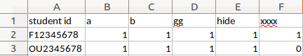

### DEMO

[](https://asciinema.org/a/uIiKTFr2qjlc0egDWqPIrRZan)

### Examples

```bash
$ cd examples/ta/
$ python3 ../../judge/ta_judge.py
Finished

$ tree .
.
├── extract/
│   ├── F12345678_HW1/
│   └── OU2345678_HW1/
├── hw1.xlsx
├── judge.conf
├── judge_resources/
│   ├── answer/
│   │   ├── a.out
│   │   ├── b.out
│   │   ├── gg.out
│   │   ├── hide.out
│   │   └── xxxx.out
│   └── input/
│       ├── a.txt
│       ├── b.txt
│       ├── gg.txt
│       ├── hide.txt
│       └── xxxx.txt
├── README.md
├── ta_judge.conf
├── ta_judge.log
└── zip/
    ├── F12345678_HW1.zip
    └── OU2345678_HW1.rar
```

```bash
$ python3 ../../judge/ta_judge.py -s OU2345678
=======+=============================================================
Sample | Accept
=======+=============================================================
     a | ✔
=======+=============================================================
     b | ✔
=======+=============================================================
    gg | ✔
=======+=============================================================
  hide | ✔
=======+=============================================================
  xxxx | ✘
-------+-------------------------------------------------------------
diff --git a/tmp/output/xxxx_1579512618.out b/home/ben/pro/selfpro/local-judge/examples/ta/judge_resources/answer/xxxx.out
index 4f6ff86..3a2e3f4 100644
--- a/tmp/output/xxxx_1579512618.out
+++ b/home/ben/pro/selfpro/local-judge/examples/ta/judge_resources/answer/xxxx.out
@@ -1 +1 @@
4294967295-1

=======+=============================================================
Total score: 80
Finished
```

+ excel output


